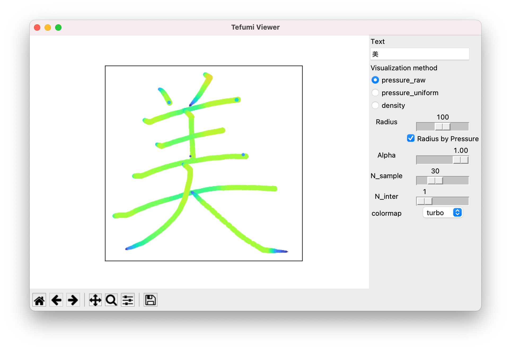

# Tefumi Strokes Data
未踏2016で用いたアノテーションフォントのデータです．

```
x: x座標
y: y座標
pressure: 筆圧
n_strokes: 画数
n_points: 一画ごとの点の数
```


## 文字を表示するデモ
```
python demo.py
```
- 筆圧の可視化
 
- 密度の可視化


## Citation
https://dl.acm.org/doi/abs/10.1145/3102163.3102197
```
@inproceedings{10.1145/3102163.3102197,
    author = {Nakamura, Masanori and Yamaguchi, Shugo and Morishima, Shigeo},
    title = {Beautifying Font: Effective Handwriting Template for Mastering Expression of Chinese Calligraphy},
    year = {2017},
    isbn = {9781450350150},
    publisher = {Association for Computing Machinery},
    address = {New York, NY, USA},
    url = {https://doi.org/10.1145/3102163.3102197},
    doi = {10.1145/3102163.3102197},
    booktitle = {ACM SIGGRAPH 2017 Posters},
    articleno = {3},
    numpages = {2},
    location = {Los Angeles, California},
    series = {SIGGRAPH '17}
}
```
